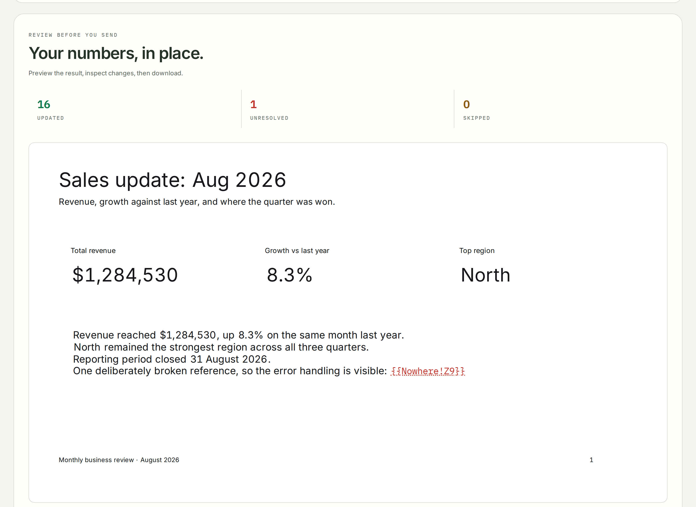

# Deck Updater

Refresh PowerPoint decks from Excel data. Mark up a template once with
`{{Sheet!A1}}` tokens and `table:` / `picture:` / `chart:` shape names; every
report cycle after that is one command, or one button.

**Live app:** https://deck-updater.vercel.app



Three independent implementations follow the same
[specification](docs/SPEC.md). The shared engine, and the Python package, is
called `slidesync`.

| Edition                        | Runs on                      | Best when                                                |
|--------------------------------|------------------------------|----------------------------------------------------------|
| [`web/`](web/)                 | Any browser, one HTML file   | You want to see every value change before you download   |
| [`python/`](python/)           | Anywhere Python runs         | Automating in a pipeline, CI, or without Office          |
| [`excel-addin/`](excel-addin/) | Excel + PowerPoint (Windows) | Analysts want a button, and pixel-perfect Excel pictures |

## What it does

* **Text tokens.** `{{Summary!B2}}`, `{{TotalRevenue}}`, `{{budget:Sheet1!B3}}`,
  with optional formats like `{{Summary!B3|0.0%}}` or
  `{{Summary!B1|date:mmm yyyy}}`. Tokens split across formatting runs are still
  replaced, keeping the formatting of the first character.
* **Tables.** Name a PowerPoint table `table:Regions!A1:D5` and it is resized
  and filled, inheriting the template's cell styling.
* **Pictures.** Name a picture `picture:Regions!A1:D5` and the range is
  rendered and swapped in at the same position, size and z-order.
* **Charts.** Name a chart `chart:Regions!A1:D5` and its data is replaced:
  categories in the first column, series across the header row, and
  `;orient=rows` flips it.
* **Multiple sources and decks** per run, a per-action **log**, and errors that
  never abort the run. A deck that hits an error is still saved, with the
  unresolved tokens left visible in it.

## Repository layout

```
docs/SPEC.md        behaviour every edition implements
web/                single-file browser app with slide preview and PDF export
python/             package, CLI and tests
excel-addin/        UI workbook and VBA modules
examples/basic/     sample generator (workbook, marked-up template, config)
examples/investment-view/
                    a worked case: one valuation model, one deck, per company
vercel.json         static-host config for web/
```

## Quick start: browser

Open `web/index.html`. Press **Try the sample**, or drop in a workbook and one
or more templates. Nothing is uploaded anywhere.

## Quick start: Python

```bash
pip install -e python
python examples/basic/make_samples.py out/sample
slidesync run out/sample/config.json
```

Open `out/sample/output/sales_update.pptx` and `log.csv` to see the result.

## Quick start: Excel

Open `excel-addin/DeckUpdater.xlsx`, import the modules in `excel-addin/src/`,
run `InstallButtons`, save as `.xlsm`, fill the Setup sheet, then press
**Update decks**. Details in [`excel-addin/README.md`](excel-addin/README.md).

## Worked example: an investment view

[`examples/investment-view/`](examples/investment-view/) is the case that shows
why the log and the read-back check matter. One Lynch/Buffett valuation model
feeds a six-slide client deck; swap in a different company's workbook and all
forty-two figures, both charts and every table follow.

The model also refuses to answer when it should. Eleven checks run against its
own inputs, and a blocking flag withholds the fair value entirely, returning
`REVIEW` instead of a confident BUY or SELL. The README there explains two
scoring bugs found along the way that are worth reading before trusting any
scored model, including one that pinned a module at 100 for every company
tested.

## Deploying the web app

The browser edition is static files with no build step, so any static host
works. `vercel.json` points Vercel at `web/`, sets a content-security policy
and turns off unused browser permissions.

```bash
npm i -g vercel
vercel          # preview deployment
vercel --prod   # production
```

Or import the repo at vercel.com/new. There are no settings to change.

`web/vendor/` holds JSZip, SheetJS and jsPDF, so the deployed site fetches no
third-party JavaScript. The page loads them from there and falls back to a CDN
only when the folder is absent, which is what keeps the single `index.html`
working on its own. The hosted policy deliberately leaves the CDN out of
`script-src`: if `vendor/` ever goes missing, the fallback is blocked and fails
loudly rather than quietly reaching out.

Two other things in that policy are deliberate:

* `connect-src 'none'` means the app makes no network request after load. No
  upload, no telemetry, no API. The policy says so, so a stray request would
  fail loudly rather than pass unnoticed.
* `'unsafe-inline'` is required because the app is one file with inline
  `<style>` and `<script>`. Splitting them out with hashes would remove it, at
  the cost of the single-file property.

Google Fonts is the one remaining third-party request. The page renders with
the system fallback stack if it is blocked; vendor the two woff2 files into
`web/` and repoint the `@font-face` rules to remove it entirely.

`web/og.png` is the link preview card shown when the URL is pasted into
LinkedIn, Slack or a CV.

## Changes from review

A September 2026 review of the browser and Python editions raised fourteen
issues, all of which are fixed. The ones worth knowing about as a user:

* A Python run will no longer accept an output path equal to one of its own
  inputs, or two decks writing to the same file. Both used to destroy the
  template's tokens on the first run.
* Source aliases differing only in case are rejected instead of silently
  shadowing each other.
* One unreadable deck no longer aborts the batch, and the log is written even
  when a deck fails.
* Single-letter Excel date patterns (`m/d/yyyy`) work, and `hh:mm` is minutes
  rather than months.
* The Excel edition forces macros off while opening a source workbook, and
  matches open workbooks by full path rather than by file name.
* Charts with negative values are drawn against a signed axis in the preview
  and the PDF. A loss used to appear as a gain.
* Numeric and date chart categories are written as numbers with a format code
  rather than as display text in a numeric cache.

## Tests

```bash
pip install -e "python[dev]"
pytest python/tests
```

## License

MIT. See [LICENSE](LICENSE).
